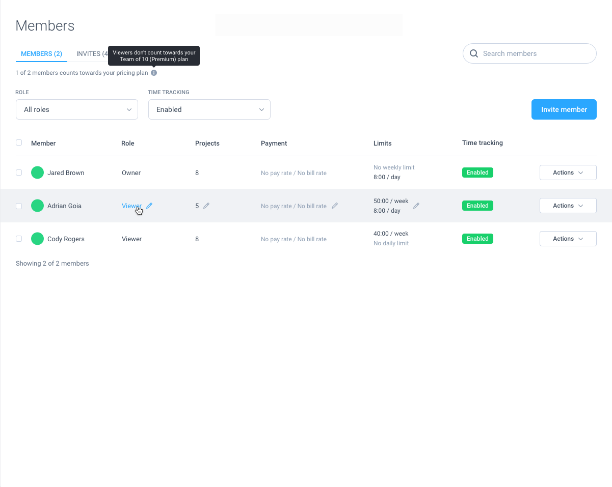

# Hubstaff's Frontend Challenge
The goal of this exercise is to understand and assess candidate's frontend development skills. 

As you go through the pair programming session, it's helpful to share what you're thinking as it helps us understand your strategy and makes it easier for us to provide hints if/when necessary.

There are multiple correct ways to implement a solution for this challenge. Done is better than perfect.

## Prerequisites
- Git
- npm

## Project Setup
Clone the project
```
git clone https://github.com/miguelcdpmarques/hubstaff-frontend-challenge.git && cd hubstaff-frontend-challenge/
```

Install the dependencies
```
npm install
```

Start the server
```
npm run serve
```

Check the project running on localhost: 
[http://localhost:8080/](http://localhost:8080/)

#### Please set up your working environment before the interview (working server, npm dependencies), so we don't spend time installing anything.


## Project Description
At Hubstaff, we're building a time tracking product. One of the features we need to implement is allowing **Organization Admins** to check information regarding the **Members** of their teams. 



The challenge proposed is to implement the **Members** tab just like you see it on the image above. Feel free to add the **Invites** tab as disabled, so it can't be navigated to.

We're expecting the search functionality to work (*Search Members* by name), as well as the *ROLE* and *TIME TRACKING* filters. We aren't expecting any of the buttons or other clickable elements to work.

We are **not** expecting a mobile responsive solution to this challenge. Please don't spend any effort on this as it will not improve the quality of the solution.

The data for the **Members** belonging to this **Organization** should be fetched from the following url address:
[https://run.mocky.io/v3/e0f20e47-bbb9-4df9-9c7f-538eee40b671](https://run.mocky.io/v3/e0f20e47-bbb9-4df9-9c7f-538eee40b671)

Here's what the response should look like:
```
{
  "count": 3,
  "members": [
    {
      "name": "Jared Brown",
      "role": "Owner",
      "projects": 8,
      "payment": null,
      "limits": {
        "weekly": null,
        "daily": 8
      },
      "time_tracking": "enabled"
    },
    {
      "name": "Adrian Goia",
      "role": "Viewer",
      "projects": 5,
      "payment": null,
      "limits": {
        "weekly": 50,
        "daily": 8
      },
      "time_tracking": "enabled"
    },
    {
      "name": "Cody Rogers",
      "role": "Viewer",
      "projects": 8,
      "payment": null,
      "limits": {
        "weekly": 40,
        "daily": null
      },
      "time_tracking": "enabled"
    }
  ]
}
```

We recommend you use [Axios](https://github.com/axios/axios) to fetch the request, but it's not mandatory.

We've configured the project using smart defaults. We're using [Sass](https://sass-lang.com/) as a CSS pre-processor and [Bootstrap-vue](https://bootstrap-vue.org/) as a UI components library. These should help speed up the development process. Again, they're not mandatory so feel free to use what you're comfortable with.

## Project Submission
Please clone the repository and submit a Pull Request with your proposed solution.

## Evaluation Criteria
We'll be looking at the following criteria when assessing candidate submissions:
- Project architecture
- Code simplicity and clarity
- Git history, including comments in the PR

**Good luck!**
